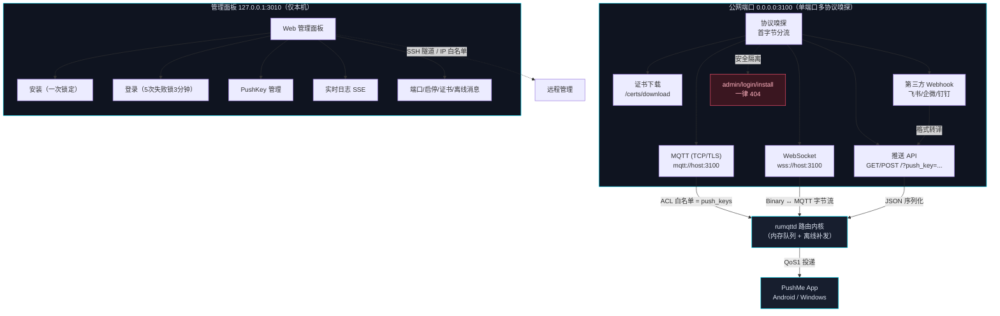

---
AIGC:
  ContentProducer: '001191110102MAD55U9H0F10002'
  ContentPropagator: '001191110102MAD55U9H0F10002'
  Label: '1'
  ProduceID: '91c4d118-36f2-4574-b9f9-800f1c9faa5f'
  PropagateID: '91c4d118-36f2-4574-b9f9-800f1c9faa5f'
  ReservedCode1: 'cbc1fd32-f75b-4d0a-a14b-c6c4b10274d4'
  ReservedCode2: 'cbc1fd32-f75b-4d0a-a14b-c6c4b10274d4'
---

# PushMe Server（Rust 版）

用 Rust 完整重写的 [PushMe](https://github.com/yafoo/pushme-server) 自建消息推送服务端。**本仓库为基于 Rust 的全新实现**，非 Node.js / Go 版本的移植副本。

协议与接口与官方 Node.js 版完全兼容：消息推送 API、MQTT / WebSocket 通道、`config/data.json` 配置格式、官方 md5 密码均可直接迁移，PushMe App（Android / Windows）可无缝接入。

同时修复了历史 Go 版（mumuopen/pushme-server）的一个安全缺陷：**管理面板默认暴露在公网端口**，任何未安装完可被抢占接管。

> 版本历史与变更说明见 [CHANGELOG.md](./CHANGELOG.md)。

---

## 架构



---

## 特性

| 类别 | 能力 |
|---|---|
| 推送 API | `push_key` / `temp_key` / 多 key（≤100）/ 参数校验，与官方一致 |
| 第三方兼容 | 飞书 `msg_type`、企微 / 钉钉 `msgtype` 自动转译 |
| MQTT | v3.1.1 协议前端（自研）+ rumqttd 路由内核；ACL = push_keys 白名单；keepalive 对齐官方；QoS1 投递 |
| WebSocket | 任意路径升级（子协议 `mqtt`），Binary 帧 ↔ MQTT 字节流 |
| TLS | `none / self / public` 三模式；自签名证书生成（多域名 SAN）；证书下载 |
| 管理面板 | 安装 / 登录 / push_key 管理 / 消息测试 / 实时日志（SSE）/ 端口 / 启停 / 证书 / 离线消息设置 |
| 离线消息 | 可配置开关：无在线订阅者时入队缓存，重连后按序补发（官方没有的增强） |
| 配置兼容 | `config/data.json` 与官方格式一致，官方旧配置可直接使用；md5 密码首登自动升级 bcrypt |

## 安全设计（与 mumuopen 版的关键差异）

| 项目 | mumuopen 版（Go） | 本版（Rust） |
|---|---|---|
| 公网 3100 上的管理路由 | admin/login/install 全部可达（未安装时可被抢占） | **一律 404**（除非显式 `public_panel=true`） |
| 面板监听 | 默认 127.0.0.1 但被公网 fallback 架空 | 独立监听 `127.0.0.1:3010`，真正仅本机 |
| 登录会话 | 明文用户名 cookie | HMAC-SHA256 签名 session（HttpOnly） |
| 登录限速 | 无 | 5 次失败锁 3 分钟（对齐官方） |
| 密码存储 | bcrypt | bcrypt（官方 md5 密码首登自动升级） |
| 面板 IP 白名单 | 有 | 有（支持 CIDR，空 = 不限制） |

---

## 快速开始

### 编译

```bash
cargo build --release
```

### 运行

```bash
# 数据目录默认当前目录（config/data.json、config/certs/）
./target/release/pushme-server-rs

# 指定数据目录
./target/release/pushme-server-rs --data /path/to/data
```

### 首次使用

1. 浏览器打开 `http://127.0.0.1:3010/`（管理面板，仅本机可访问）
2. 完成安装（设置管理员账号密码）
3. 「推送 Key」中添加 key，得到 `push_key` 与 `temp_key`
4. PushMe App 配置：服务器地址 `ws://域名:3100` 或 `wss://域名:3100`（TLS 模式），push_key 填上面生成的 key
5. 测试推送（公网 3100）：

```bash
# push_key 方式
curl "http://host:3100/?push_key=你的KEY&title=标题&content=内容"

# temp_key 方式
curl "http://host:3100/?temp_key=你的临时KEY&title=标题&content=内容"

# 多 key（逗号分隔，最多 100 个）
curl "http://host:3100/?push_key=KEY1,KEY2&title=标题&content=内容"
```

返回 `success` 表示成功。

### 端口

- **3100**：消息服务（MQTT / WS / 推送 API / 证书下载），面向公网
- **3010**：管理面板，仅本机（远程管理走 SSH 隧道或显式改绑 + IP 白名单），**不要放公网**

---

## 推送 API 详解

```
GET/POST http://host:3100/
```

| 参数 | 必填 | 说明 |
|---|---|---|
| push_key | 二选一 | 推送目标 key，逗号分隔多个（≤100） |
| temp_key | 二选一 | 临时 key，服务端反查真实 key |
| title | 否 | 标题（title/content 至少一项） |
| content | 否 | 内容 |
| type | 否 | 消息类型 |
| date | 否 | 自定义时间，缺省自动注入当前时间 |

### 第三方 webhook 兼容（飞书 / 企微 / 钉钉）

直接传第三方格式参数自动转译：

- **飞书**：`msg_type`（text / post / share_chat / image / interactive）+ `content` JSON
- **企微**：`msgtype`（text / markdown / image / news / file / template_card / link / actionCard / feedCard）+ `{msgtype: {...}}` JSON
- **钉钉**：`msgtype`（text / markdown / link / actionCard / feedCard）+ `{msgtype: {...}}` JSON

响应为第三方格式 `{"errcode":0,"errmsg":"success","code":0,"msg":"success"}`。

---

## 管理面板功能（对齐官方）

- **推送 Key**：增 / 删 / 改备注，自动生成 `push_key` + `temp_key`
- **消息测试**：面板内直接发测试推送
- **端口设置**：改消息服务端口 / 面板端口（1-65535，重启后生效）
- **服务启停**：设置消息服务 start / stop（重启后生效）
- **日志**：历史查询（最近 100 条）+ 清空 + SSE 实时流（`/api/log/stream`）
- **TLS**：消息服务 TLS 模式；面板独立 TLS（`panel_tls: "tls"` 时面板走 HTTPS，互不影响）
- **证书**：生成自签名证书支持多域名 / IP（自动补 127.0.0.1 与 ::1）
- **离线消息**：开关 + 条数上限（1-1000，立即生效）
- **网络**：面板绑定地址 / 公网面板开关（默认关，不推荐开）

---

## 配置（config/data.json）

与官方格式兼容，扩展字段带默认值，官方旧配置可直接复制使用。

```jsonc
{
  "config_version": 2,
  "server_port": 3100,        // 消息服务端口
  "panel_port": 3010,         // 面板端口
  "panel_bind": "127.0.0.1",  // 面板绑定地址（安全默认）
  "public_panel": false,      // 公网端口是否开放管理路由（不推荐）
  "push_keys": [              // push_key 列表（字符串或 {key,temp_key,note}）
    { "key": "PUSHME-xxx", "temp_key": "yyy", "note": "" }
  ],
  "user": "md5(用户名)",       // 官方 md5 格式（兼容迁移）
  "password": "md5(密码)",
  "pass_hash": "bcrypt哈希",   // 本版新增（首登自动升级）
  "admin_user": "admin",       // 明文用户名（本版新增）
  "panel_allowed_ips": [],     // 面板 IP 白名单（CIDR），空=不限制
  "tls": "none",               // none | self | public（消息服务 TLS）
  "panel_tls": "none",         // none | tls（面板独立 TLS）
  "status": "start",           // start | stop（消息服务启停）
  "offline_messages": false,   // 离线消息补发开关（默认关）
  "offline_limit": 50          // 离线缓存条数上限/每 key（默认 50）
}
```

### TLS 模式

- **self**：服务自动生成自签名证书（可在面板重新生成，多域名 / IP）；客户端需导入 `http://host:3100/certs/download`
- **public**：将证书放到 `config/certs/cert.crt` 与 `config/certs/private.key`（可用 certbot 生成）

### 离线消息（交易消息等场景）

开启 `offline_messages` 后：

- 发布时无在线订阅者 → 按 push_key 缓存到内存队列（上限 `offline_limit`，超限淘汰最旧）
- 客户端（重新）订阅时按序补发并清空队列
- 开关关闭时行为与官方一致：不缓存、不补发
- 内存队列，重启后丢失（与官方一致）

---

## 技术实现

- **协议嗅探**：单端口按首字节分流 MQTT（0x10）/ HTTP / 未知
- **MQTT**：自写协议前端（mqttbytes 编解码）+ rumqttd 路由内核；keepalive 60/300/600 → 3600（对齐官方）；订阅/发布 ACL 白名单；非法发布断开；QoS1 投递；离线消息可选开关；连接断开自动清理订阅计数
- **WebSocket**：任意路径升级（子协议 mqtt），Binary 帧 ↔ MQTT 字节流
- **管理面板**：无外部依赖单页 HTML；HMAC session；登录限速；IP 白名单；SSE 实时日志
- **TLS**：rustls + rcgen 自签名（多域名 SAN）

### 目录结构

```
src/
  main.rs      入口：端口嗅探 / TLS / 双端口监听
  config.rs    配置管理（官方 data.json 兼容）
  mqtt.rs      MQTT 协议处理 + ACL + 离线队列 + rumqttd 内核桥接
  push_api.rs  公网路由：推送 API / 证书下载 / WS / 日志缓冲
  third.rs     飞书 / 企微 / 钉钉 webhook 转译
  auth.rs      md5 兼容 / bcrypt / HMAC session / 限速 / IP 白名单
  certs.rs     自签名证书生成与加载
  panel.rs     管理面板（页面 + API）
```

### 测试

`.temp/` 下的协议级自测脚本（Python）：

- `mqtt_test.py`：MQTT TCP（连接 / 订阅 / 接收 / ACL）
- `mqtt_tls_test.py`：MQTT over TLS
- `mqtt_ws_test.py`：WebSocket MQTT
- `offline_test.py` / `offline_off_test.py`：离线消息专项
- `align_test.py`：与官方运维功能对齐（端口 / 启停 / 证书 / 日志 SSE / 401）

---

## 与上游的关系

| 版本 | 语言 | 状态 | 说明 |
|---|---|---|---|
| yafoo/pushme-server | Node.js | 上游官方 | 协议基准，功能对齐 |
| mumuopen/pushme-server | Go | 历史实现 | 存在公网面板暴露安全缺陷 |
| **本仓库** | **Rust** | **当前维护** | 协议对齐 + 安全加固 + 离线消息增强 |

## 已知限制

- 消息不持久化（重启后离线队列清空）
- `clean_session` 恒为 true
- 多实例（水平扩展）不支持